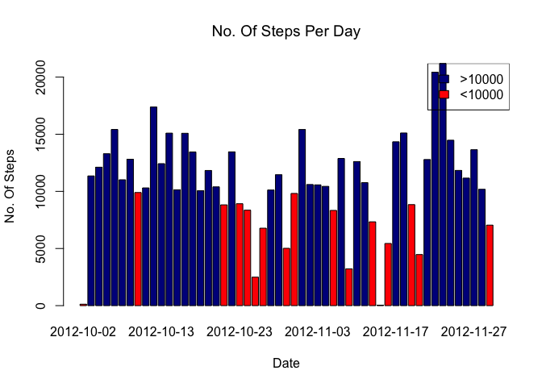
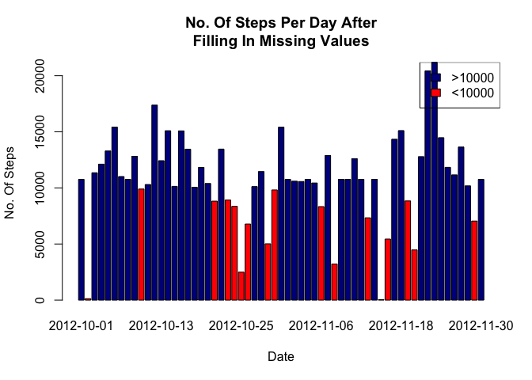
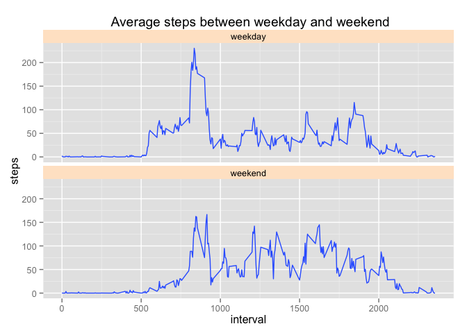

# Reproducible Research: Peer Assessment 1


## Loading and preprocessing the data
Show any code that is needed to

1. Load the data (i.e. read.csv())


```r
if(!exists("activity")) {
  unzip("activity.zip")
  
  activity <- read.csv("activity.csv", header=T)
}
```

2. Process/transform the data (if necessary) into a format suitable for your analysis


```r
  activityData <- na.omit(activity)
  activityData$date <- as.Date(activityData$date)
  head(activityData)
```

```
##     steps       date interval
## 289     0 2012-10-02        0
## 290     0 2012-10-02        5
## 291     0 2012-10-02       10
## 292     0 2012-10-02       15
## 293     0 2012-10-02       20
## 294     0 2012-10-02       25
```


## What is mean total number of steps taken per day?
For this part of the assignment, you can ignore the missing values in the dataset.

1. Make a histogram of the total number of steps taken each day

```r
aggregateTotal <- aggregate(steps ~ date, activityData, sum)

cols <- c("red", "darkblue")[(aggregateTotal$steps > 10000) + 1]
barplot(height=aggregateTotal$steps, names.arg=aggregateTotal$date, xlab='Date', ylab='No. Of Steps',main=expression('No. Of Steps Per Day'), col=cols)

legend("topright", 
       legend = c(">10000", "<10000"), 
       fill = c("darkblue", "red"))
```

 

2. Calculate and report the mean and median total number of steps taken per day

```r
meanPerDay <- as.character(round(mean(aggregateTotal$steps),0))
medianPerDay <- median(aggregateTotal$steps)
```
The mean total number of steps taken per day is 10766 and the median is 10765.

## What is the average daily activity pattern?
1. Make a time series plot (i.e. type = "l") of the 5-minute interval (x-axis) and the average number of steps taken, averaged across all days (y-axis)


```r
average_interval <- aggregate(steps ~ interval, activityData, mean)

plot(average_interval, type="l", xlab= "Intervals", ylab= "Avg Steps", main="Avg Steps Per Day", col="blue" , lwd=2)
```

 

2. Which 5-minute interval, on average across all the days in the dataset, contains the maximum number of steps?

```r
max_steps <- average_interval$interval[which.max(average_interval$steps)]
```
The maximum number of steps is 835.

## Imputing missing values
Note that there are a number of days/intervals where there are missing values (coded as NA). The presence of missing days may introduce bias into some calculations or summaries of the data.

1. Calculate and report the total number of missing values in the dataset (i.e. the total number of rows with NAs)

```r
missing_row <- sum(!complete.cases(activity))
```
The total number of missing avlues in the dataset is 2304.

2. Devise a strategy for filling in all of the missing values in the dataset. The strategy does not need to be sophisticated. For example, you could use the mean/median for that day, or the mean for that 5-minute interval, etc.

Strategy to fill in all of the missing values in the dataset with the mean value for that day.

3. Create a new dataset that is equal to the original dataset but with the missing data filled in.

```r
aggregateMean <- aggregate(steps ~ interval, activityData, mean)
aggregateMean[, 2] <- round(aggregateMean[,2],0)

aggregateMean$replaceValue <- aggregateMean$steps

activityEmpty <- merge(activity,
                          aggregateMean[,c('interval', 'replaceValue')],
                          by='interval')

activityEmpty$steps <- ifelse(is.na(activityEmpty$steps), activityEmpty$replaceValue, activityEmpty$steps)

head(activityEmpty)
```

```
##   interval steps       date replaceValue
## 1        0     2 2012-10-01            2
## 2        0     0 2012-11-23            2
## 3        0     0 2012-10-28            2
## 4        0     0 2012-11-06            2
## 5        0     0 2012-11-24            2
## 6        0     0 2012-11-15            2
```

4. Make a histogram of the total number of steps taken each day and Calculate and report the mean and median total number of steps taken per day. Do these values differ from the estimates from the first part of the assignment? What is the impact of imputing missing data on the estimates of the total daily number of steps?

```r
daily_activity <-
  aggregate(steps~date, activityEmpty,
            FUN = sum, na.rm=TRUE)

mean_daily <- as.character(round(mean(daily_activity$steps)))
median_daily <- as.character(median(daily_activity$steps),0.5)

cols <- c("red", "darkblue")[(daily_activity$steps > 10000) + 1]
barplot(height=daily_activity$steps, names.arg=daily_activity$date, xlab='Date', ylab='No. Of Steps',main='No. Of Steps Per Day After\nFilling In Missing Values', col=cols)

legend("topright", 
       legend = c(">10000", "<10000"), 
       fill = c("darkblue", "red"))
```

 

The mean total number of steps taken per day after filling in the empty values is 10766 and the median is 10762.

From the differences in calculation before and after imputing the values, the difference is negligible. Thus the impact of missing values do not affect the result of the original data.

## Are there differences in activity patterns between weekdays and weekends?
For this part the weekdays() function may be of some help here. Use the dataset with the filled-in missing values for this part.

1. Create a new factor variable in the dataset with two levels – “weekday” and “weekend” indicating whether a given date is a weekday or weekend day.

```r
activityEmpty$dayofweek <- ifelse(weekdays(as.Date(activityEmpty$date)) %in%  c("Saturday", "Sunday"),'weekend','weekday')

head(activityEmpty)
```

```
##   interval steps       date replaceValue dayofweek
## 1        0     2 2012-10-01            2   weekday
## 2        0     0 2012-11-23            2   weekday
## 3        0     0 2012-10-28            2   weekend
## 4        0     0 2012-11-06            2   weekday
## 5        0     0 2012-11-24            2   weekend
## 6        0     0 2012-11-15            2   weekday
```

2. Make a panel plot containing a time series plot (i.e. type = "l") of the 5-minute interval (x-axis) and the average number of steps taken, averaged across all weekday days or weekend days (y-axis). See the README file in the GitHub repository to see an example of what this plot should look like using simulated data.

```r
library(ggplot2)

qplot(x=interval, y=steps,data=subset(activityEmpty, complete.cases(activityEmpty)),geom='smooth', stat='summary', fun.y=mean) + facet_grid(dayofweek~.) + facet_wrap(~dayofweek,nrow=2) + theme(strip.background = element_rect(fill="#ffe5cc")) + labs(title=' Average steps between weekday and weekend')
```

 

